# 亚健康管理系统
---
## 环境：
#### 基于SpringBoot3，MyBatis-plus，MySQL，Vue2，Element-UI等，实现前后端分离
#### 运行需配置Java，MySQL，Node， Vue等环境
- ##### Java：17
- ##### MySQL：8
- ##### Node：20
- ##### Vue：2
---
## 项目介绍：
#### 本项目旨在制作一个集合化的健康管理系统，将用户信息、运动知识、用户身体信息等管理系统集成，并实现了健康评分，实现强大的健康管理。
##### （夹带私货bb前端的配色取自喜欢的一位角色——流萤...「梦是一种愿望的达成，也是梦者的自我欺骗」）

#### 具体模块：
- ##### 登录&注册
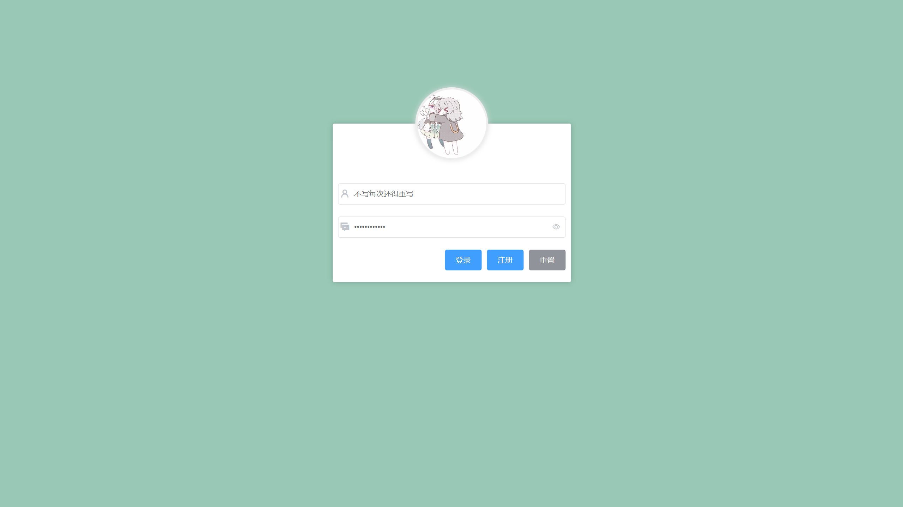
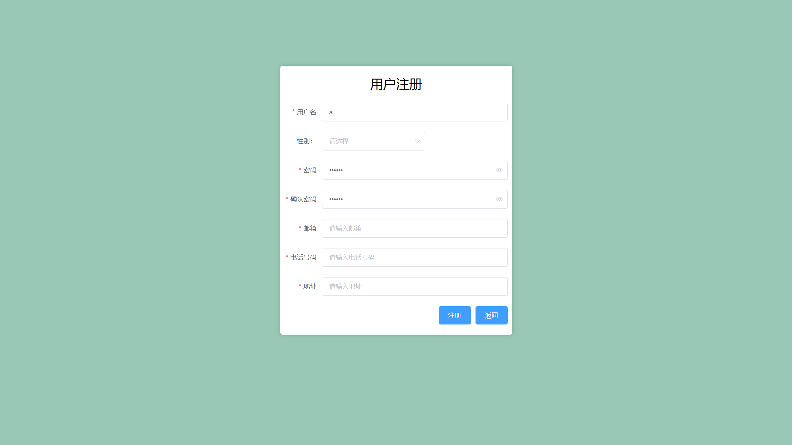
- ##### 首页
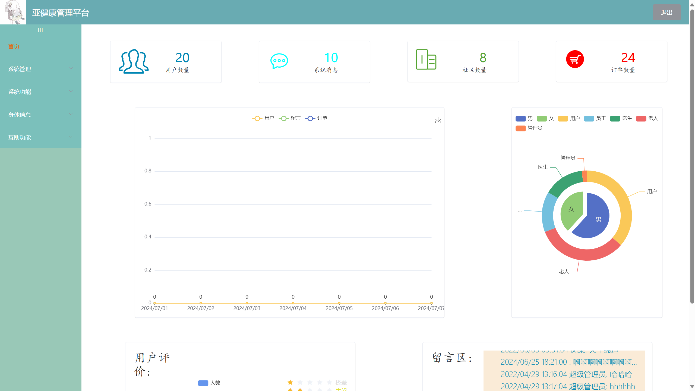
- ##### 系统管理 > 用户管理
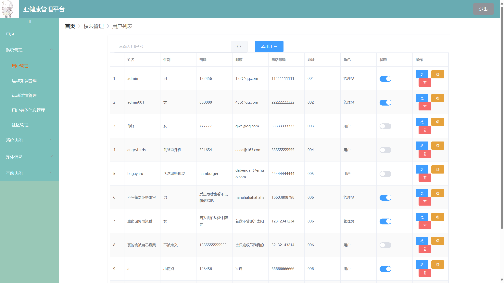
- ##### 系统管理 > 运动知识管理
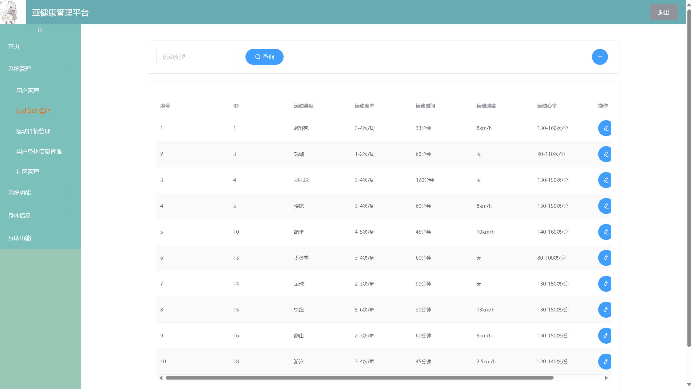
- ##### 系统管理 > 运动详情管理
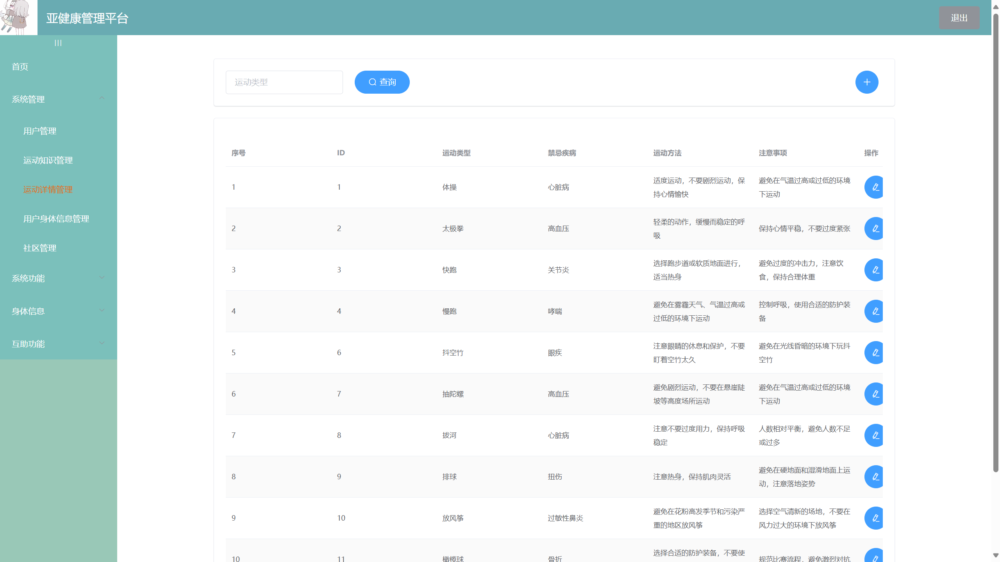
- ##### 系统管理 > 用户身体信息管理
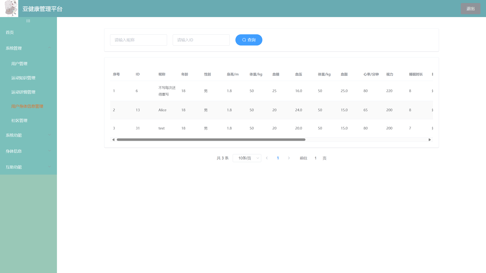
- ##### 系统管理 > 社区管理
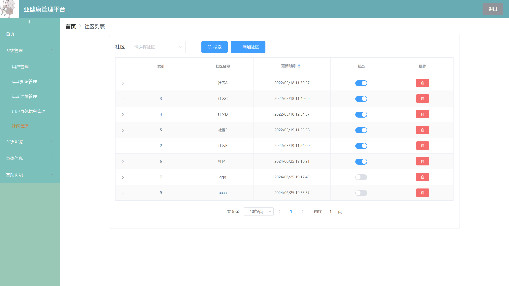
- ##### 系统功能 > 运动知识
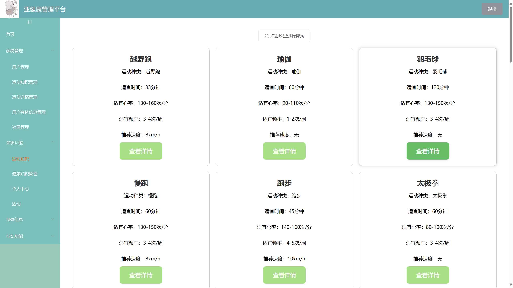
- ##### 系统功能 > 健康知识管理
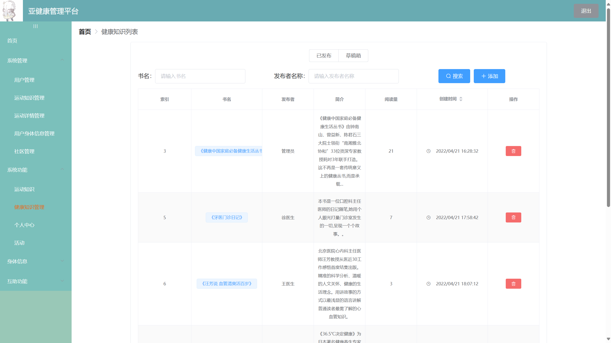
- ##### 系统功能 > 个人中心
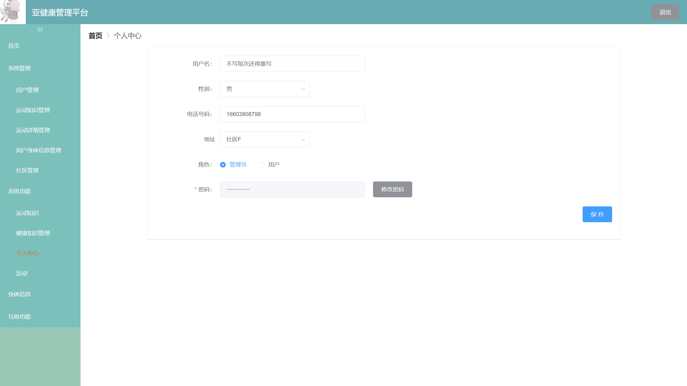
- ##### 系统功能 > 活动
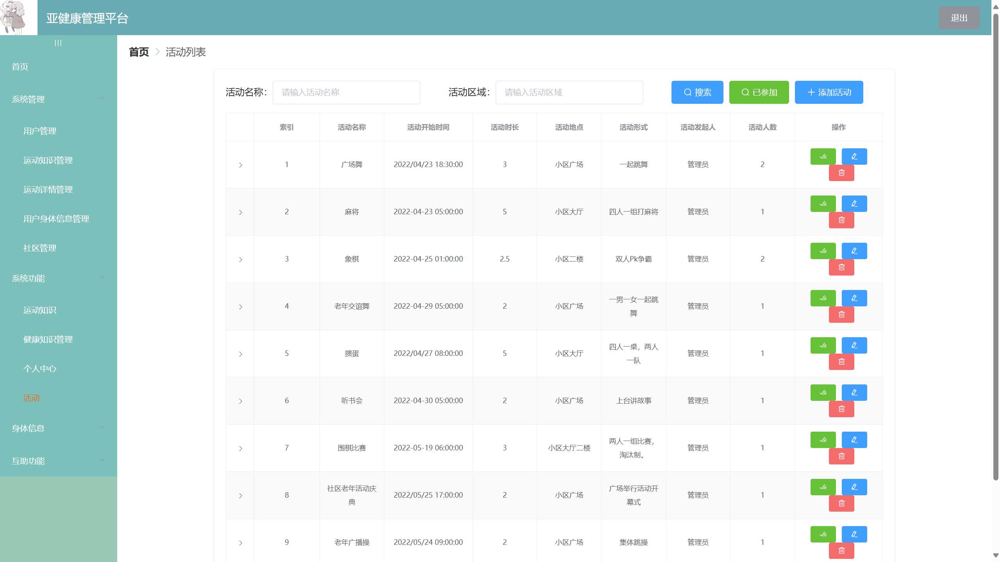
- ##### 身体信息 > 身体信息上传
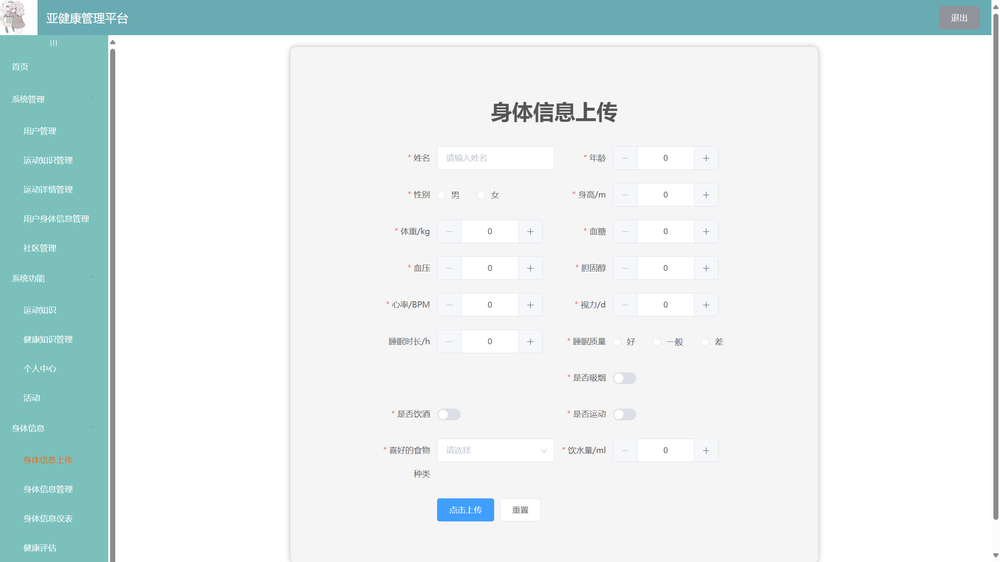
- ##### 身体信息 > 身体信息管理
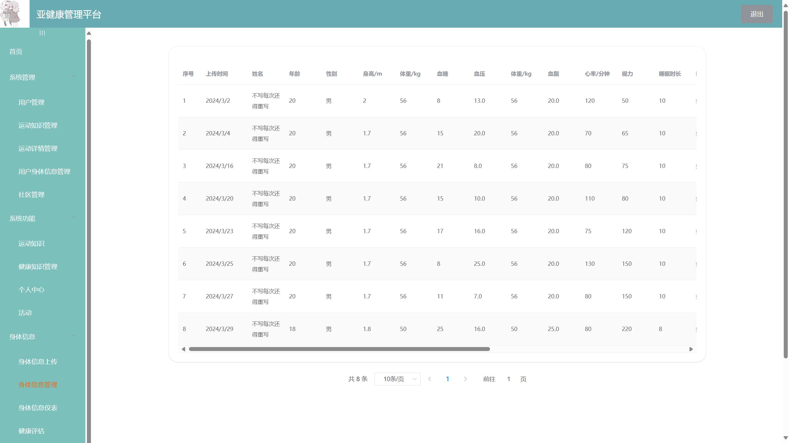
- ##### 身体信息 > 身体信息仪表
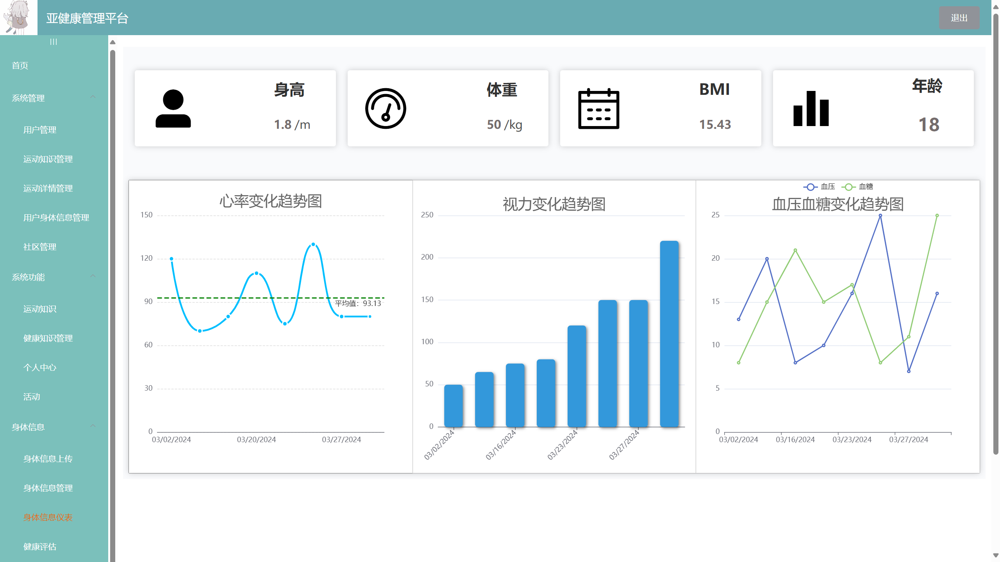
- ##### 身体信息 > 健康评估
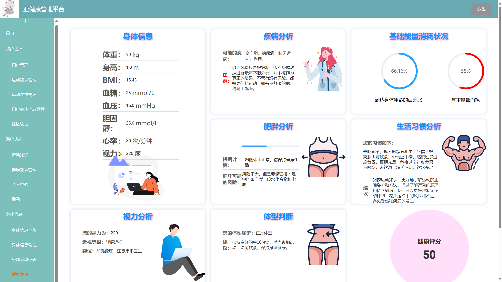
- ##### 互助功能 > 餐饮互助
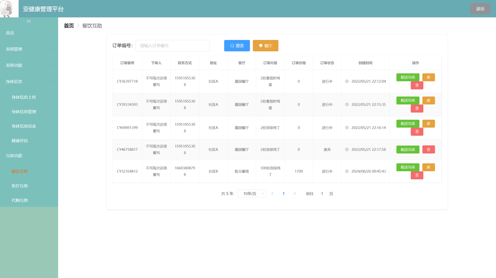
- ##### 互助功能 > 医疗互助

- ##### 互助功能 > 代购互助
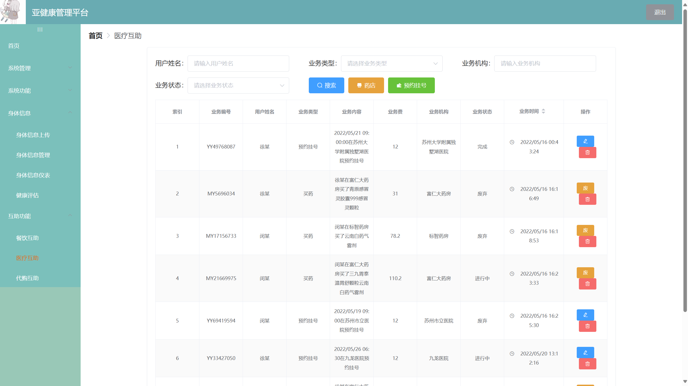
---
#### 第一个项目，还请多多指教！